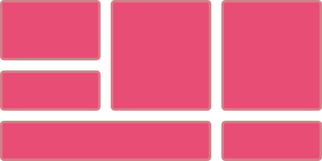
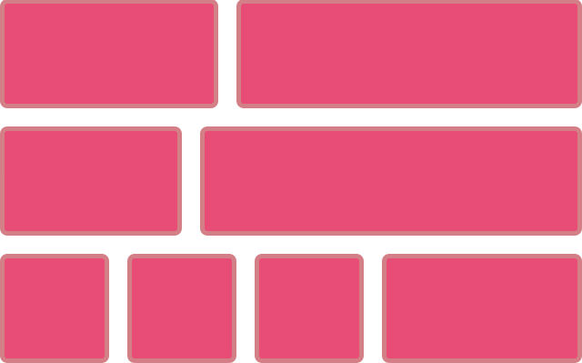

CSS Grid is such a different way of approaching layout that there are a number of common questions I am asked as people start to use the specification. This article aims to answer some of those, and will be one in a series of articles on Smashing Magazine about layouts.

## Why Use Grid Instead Of Flexbox?

Prior to CSS Grid Layout landing in browsers, many people saw flexbox as the answer to all of our design-related problems. However, flexbox doesn’t provide a grid system any more than floats do, although it does make creating one simpler. A true grid is two-dimensional. The two dimensions are rows and columns, and with grid layout you can control both at once. With flexbox, you choose whether to lay the items out as a row or a column, one or the other and not both.

Here is a simple example which highlights the difference. The first layout uses flexbox to display as many boxes as will fit into the available width. Here we are controlling the layout across the row. We are allowing the flex items to wrap, so they create new rows, but each row is a new flex container. The space distribution happens across the row and so depending on how many items the final row has, they sometimes won’t line up with the items above to make a grid.

## Should Grid Be Used For Main Layout And Flexbox For Components?

This myth keeps popping up as people start to learn grid layout. Perhaps it comes from the use of grid systems such as those found in Bootstrap or Foundation where we are concerned with placing items on an overall grid. That is certainly one way to use grid layout. I would however move to thinking about the differences I mentioned in the last section. Ask yourself, is this layout one or two dimensional?
If you can take your component and draw a grid over it, with rows and columns. It is two-dimensional — use grid layout for that.

    A grid has strict rows and columns. Changing the size of an item in a cell in a row or column will change the size of the entire track.

If instead, you want individual items to expand within a row, without respecting what happens in the row above. That’s a flex layout.

    In this flex layout we want items to arrange themselves by row, and not try to line up as columns.

It doesn’t matter if the item you are trying to lay out is a full page, or a tiny component. What matters is how you want the items inside that layout to distribute space and relate to each other.

## Can Grid Track Sizing Be Dictated By Content?

We’ve now seen how, when using Grid Layout, we set up the grid and grid sizing on the container. However it is possible for items inside the grid to dictate track sizing. The key thing to remember here is that a change of size in one cell will change the size all along that track. If you don’t want that to happen, you probably want a single dimensional flex layout.
The simplest way in which we see items changing the sizing of their track is when we use auto, which is the default for tracks created in the implicit grid. An auto sized track will expand to contain all of the content placed into it. In the example below I have a two-column layout, adding more content to the right hand column causes the whole row to expand. The second row is also auto sized, again expanding to contain the content.

We can allow tracks to size within two parameters, for example creating tracks that are at least a minimum size but will still grow to accommodate larger items. We do this with the minmax() function. The first value passed into minmax() being a minimum size for the track, and the maximum the maximum size. Therefore you can form rows that are 200 pixels tall but by setting the maximum as auto ensure that you don’t end up with overflows when there is larger content.

We also have some interesting new sizing keywords, that I’ll be having a proper look at in a future article. These work with grid specifically to allow content to change track sizing, and can be found detailed in the CSS Intrinsic and Extrinsic Sizing module. The keyword min-content for example, when used for grid track sizing will create a track that displays as small as possible when all soft-wrapping opportunities are taken.
In my example below this means the word opportunities. becomes the widest thing and the track shrinks down to fit that.

The opposite happens if you use max-content — you get a track that stretches as large as possible without wrapping. This may lead to overflow situations, in my example I have set the grid to overflow: scroll so the max-content track is causing a scrollbar.

Once again, the key thing to remember is that this is going to happen right across the track. You need to ensure that items in other cells of that track will also absorb that extra space neatly.
Understanding how to size tracks, and how content will change track sizing is probably one of the things that newcomers to grid layout find most confusing. It’s ok to find this takes a little while to understand — we’ve not had anything that behaves like this before. Play with examples, it is the best way to start to understand how things work.