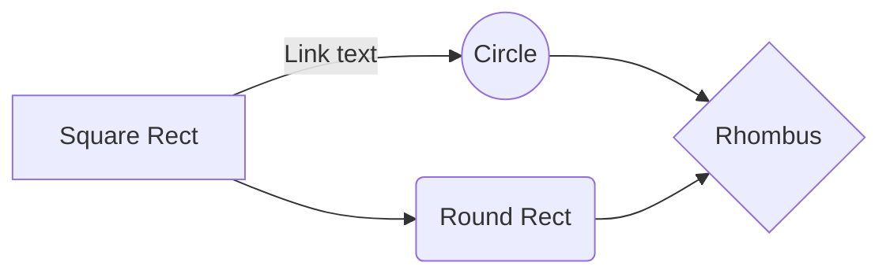

##  NOTE: webpack 4 is out and tested, this setup is a bit obsolete, you can do better!!!

git clone https://github.com/ellwarco/react-redux-router-saga-material-postcss-webpack
Then npm start and do your coding inside src/ folder.

## Now for the step by step



First, you need to have npm and node installed. This goes without saying, but there, I said it.
Open your terminal. I am using ubuntu, so if you see some system commands you don’t know, it’s ubuntu, look it up for whatever you use.
Then, create a new folder, get inside and npm init -y . We are on a roll!!!
Ok, so first we will install webpack.

```ruby
npm i -D webpack
```

Webpack is a module bundler. This means, it will take some files as input, and create other files as output, using the configuration we provide in webpack.config.js file. Let’s go on and create this file:

```ruby
touch webpack.config.js
```

What we want here, is to have one folder where we can write code, make it readable and well organized, and another folder where the compressed and optimized version of the code will go, ready for the browser. Many optimizations are done with webpack, and it will make the end user experience much better ( in terms of speed mostly ).
Let’s create one of these folders, named src. 
In it, create a file called index.js.

```ruby
mkdir src
cd src
touch index.js
```

In this file, just put any JS code, like some console.log(‘here we go’);

## WEBPACK BASIC

Now we will have webpack take this file and create a new file in public folder ( it will also create the folder for us ). Open the webpack.config.js and put this in:

```ruby
const path = require('path');
module.exports = {
    entry: "./src/index.js",
    output: {
        filename: 'bundle.js',
        path: path.resolve(__dirname, 'public')
    }
}
```
That module.exports tells what will be exported for use elsewhere, and this is our configuration object. The first line imports something ( in this case, the path ). So, as you can see, we can organize our code in modules and import and export stuff at will.

But first, where is this path module coming from? Maybe you noticed a node_modules/ folder when you installed webpack. This folder contains all the modules someone else built that you ( or a module you want ) use. Webpack needs path, so path got installed with it. You can just use it whenever.

So, our object has two props, entry and output. Pretty simple, entry is the file we want to load ( mind the ./ in the location string ), and output requires a filename and a path. The reason we used the path module is now clear: we don’t want an absolute path here, we want that it to be relative to wherever we are in the file system.
Before we fire off webpack, let’s actually make it a script, so we can use npm for this. Go in the package.json, and find the scripts. Let it look like this:

```ruby
"scripts": {
    "start": "webpack"
  },
``` 

Now go back to the terminal and run npm start . This command runs webpack, webpack reads from the config file, creates the public folder and populates it. Check out the bundle.js and find our console.log. This looks like just adding more code now, but it pays off.

Just to understand webpack imports a bit more, make another file next to index.js and name it test.js. Put this inside:

```javascript
export default 5;
```

Now open index.js and:

```javascript
import test from './test';
console.log(test);
```

run npm start and the test.js file is included and bundled with index.js contents inside public/bundle.js. This is how import/export works. You will have just one main file, index.js, and import stuff you need. Webpack will optimize the imports for you, and everything will be served in one file for the browser to consume.

Also note, the webpack does not actually run the files, so you might get errors in the browser after the bundle.
Now delete test.js and run npm start. Checkout the error. The red part tells you exactly where you are trying to import a non-existing module. This can be handy if you misspell or forget.

OK, so on with webpack, a lot to cover. Add this line

```javascript
context: path.resolve(__dirname, 'src')
```

as the next property in our object, and remove the /src from entry string. It now looks like this:

```javascript
const path = require('path');
module.exports = {
    entry: "./index.js",
    output: {
        filename: 'bundle.js',
        path: path.resolve(__dirname, 'public')
    },
    context: path.resolve(__dirname, 'src')
}
```

This line adds the context in which the bundle happens. For us, it’s the src/ folder.

## HTML

Every good front end needs an html file named index.html. We plan to do all our work inside the src/ folder, let’s make one there. Populate it like this:

```html 
<!DOCTYPE html>
<html lang="en">
<head>
  <title>Basic Setup</title>
  <meta charset="utf-8">
  <meta http-equiv="X-UA-Compatible" content="IE=edge">
  <meta name="viewport" content="width=device-width, initial-scale=1">
<link rel="shortcut icon" type="image/x-icon" href="/favicon.ico"/>
</head>
<body>
<div id="app"></div>
</body>
</html>
``` 

As you notice, we don’t load the js, nor will we load the css. Webpack will do that for us. Now, webpack also needs to copy this file ito the public/ folder. For this, we will use some plugins webpack has. Webpack has a lot of plugins, and they extend the basic functionality. Let’s install what we need

```ruby
npm i -D html-webpack-plugin
``` 

In our webpack.config.js, load the plugin under the path module

```ruby 
const HtmlWebpackPlugin = require('html-webpack-plugin');
``` 

Inside the config object, add a plugins array, and use our plugin there. It all looks like this now

```ruby 
const path = require('path');
const HtmlWebpackPlugin = require('html-webpack-plugin');
module.exports = {
    entry: "./index.js",
    output: {
        filename: 'bundle.js',
        path: path.resolve(__dirname, 'public')
    },
    context: path.resolve(__dirname, 'src'),
    plugins: [
     new HtmlWebpackPlugin({
            template: 'index.html'
        })
    ]
}
``` 

We defined the template for the index.html. Now run npm start again, and look in the public/ folder. Note that we are now loading bundle.js inside index.html in public/ folder. As I said, let webpack do it’s work.

Great, so now we have a file we can run in the browser. If you do, you will notice it runs the code from index.js. Console something to make sure.

## DEVELOPMENT SERVER

Next thing we need is a development server. If we have to run npm start and open the file in our browser every time we change something, it’s gonna suck. It’s better to let webpack do that too. Webpack has something called webpack-dev-server, let’s install it:

```ruby 
npm i -D webpack-dev-server
``` 

Inside package.json, change “start”: “webpack” to “start”: “webpack-dev-server” . Now run npm start again, and it will tell you to open your browser at url: http://localhost:8080/. You can see your project here. 
Change something in index.js, and go back to the browser. It will immediately update. Now you can work and check your progress without any steps between. That’s really great.

If you want to stop the server, just ctrl-c in the terminal. Make another script for just building the app without running it, we will need it later. Now the package.json script part looks like this:

```javascript
"scripts": {
    "start": "webpack-dev-server",
    "build": "webpack",
    "build-prod": "webpack -p"
  },
``` 

If you run npm run build you will see the same as before. But the build-prod script has the -p flag, which tells webpack to optimize for production. Run npm run build-prod and check bundle.js. Now it’s compressed and better optimized for the browser. However, we will use the development mode to develop, as it is easier.

Let’s make even more better, by making webpack open the browser tab for us. Add following prop in the webpack.config.js:

```ruby
devServer: {
   contentBase: path.resolve(__dirname, 'public/assets'),
   stats: 'errors-only',
   open: true,
   port: 8080,
   compress: true
},
``` 

Run npm start , and admire how it opens a tab in your browser on it’s own. What we did here, is that we added a configuration for the development server, telling it to serve images from /public/assets, show only errors, open specific port and gzip compress the output.

## STATIC ASSETS ( IMAGES… )

We want to be able to serve static assets, such as images. Let’s make an assets/ folder inside src/ and put an image inside. We should be able to get that image inside our index.js like so:

```javascript
import img from './assets/image.png';
console.log(img);
``` 

But if we run npm run buildwe get an error. This is because does not know this is a static file, and it tries to parse it. Let’s tell webpack what to do here. We need something called a loader. A loader in webpack is a tool used to pre-process certain files, like images. Let’s install it:

```javascript
npm i -D file-loader
``` 

Now extend the webpack.config.js with the lines near the bottom. Pasting the whole file:

```javascript
const path = require('path');
const HtmlWebpackPlugin = require('html-webpack-plugin');
module.exports = {
    entry: "./index.js",
    output: {
        filename: 'bundle.js',
        path: path.resolve(__dirname, 'public')
    },
    context: path.resolve(__dirname, 'src'),
    devServer: {
        contentBase: path.resolve(__dirname, 'public/assets'),
        stats: 'errors-only',
        open: true,
        port: 8080,
        compress: true
    },
    plugins: [
        new HtmlWebpackPlugin({
            template: 'index.html'
        })
    ],
    module: {
        rules: [{
            test: /\.(jpg|png|gif|svg)$/,
            use: [
            {
                loader: 'file-loader',
                options: {
                    name: '[name].[ext]',
                    outputPath: './assets/',
                }
            }]
        }]
    }
}
``` 

You can see we added a module prop, in it rules prop. This is how things are organized in webpack3, don’t worry about it. The takeaway here is, rules is an array, and you pass loaders to it. Every loader needs a test to check if it should run on the file, and an actual loader module with options. We see here that we want the file-loader to take over image files. 

Run npm run build and check the public/ folder. There will be an assets folder in there, with our image. Webpack will only copy images here if they are imported somewhere in the code. You can also run npm start , because we configured the assets folder for static files.

## CLEAN WEBPACK

Now, let’s say you change or remove an image, or some other file. Webpack already copied it before. 
Now that you don’t use it, it’s still there, taking up space. It would be easier to just copy the public/ folder to the production server without worrying about extra files. There is a plugin for this:

```javascript
npm i -D clean-webpack-plugin
``` 

Setting it up in webpack.config.js

```javascript
const CleanWebpackPlugin = require('clean-webpack-plugin');
...
plugins: [
new CleanWebpackPlugin(['public']),
...
]
``` 

We tell this plugin to remove the public folder whenever it rebuilds, so that only what we actually use gets inside. If you worry about the dev speed, the dev server doesn’t actually create the folder, as you will see. 
Run npm start You will notice that the public/ folder is no longer here, yet we can load all the images and files. This is to make development faster, so that each change in the code shows up in the browser right away.
But if you run npm run build you will see the public/ folder there again, and this shows the difference between development and production.

## ADDING CSS FILES

We want to be able to separate styles from the rest of the code. We are going to do that in a way that allows us to load a .css file anywhere we want.
Let’s make a folder called styles in src/ folder, and put a main.css file inside. Put some css in the file, like this

```css
body {
 background: red;
}
``` 

We can also import this file in our index.js

```ruby
import './styles/main.css';
``` 

Mind the path to the file. Now run npm start and you’ll get an error: ‘You may need an appropriate loader to handle this file type.’ Great, we know what to do, let’s add the css loader from the terminal

```ruby
npm i -D css-loader
``` 
and add the loader rule to the webpack.config.js, inside the rules prop

```ruby
const path = require('path');
const CleanWebpackPlugin = require('clean-webpack-plugin');
const HtmlWebpackPlugin = require('html-webpack-plugin');
module.exports = {
    entry: "./index.js",
    output: {
        filename: 'bundle.js',
        path: path.resolve(__dirname, 'public')
    },
    context: path.resolve(__dirname, 'src'),
    devServer: {
        contentBase: path.resolve(__dirname, 'public/assets'),
        stats: 'errors-only',
        open: true,
        port: 8080,
        compress: true
    },
    plugins: [
     new CleanWebpackPlugin(['public']),
        new HtmlWebpackPlugin({
            template: 'index.html'
        })
    ],
    module: {
        rules: [{
            test: /\.(jpg|png|gif|svg)$/,
            use: [
            {
                loader: 'file-loader',
                options: {
                    name: '[name].[ext]',
                    outputPath: './assets/',
                }
            }]
        }, {//HERE ARE THE NEW LINES
         test: /\.css$/,
         use: "css-loader"
        }]
    }
}
``` 

If we run npm start our code will run and open the browser. But the background isn’t red. This is because we now have a loader to handle css code, but it cannot be inside the js file on it’s own. We need a way to actually connect it to the code in an ordinary fashion. Back to the terminal:

```ruby
npm i -D style-loader
``` 

This loader will actually load the styles into the system. Let’s edit the config:

```ruby
...{
   test: /\.css$/,
   use: ["style-loader", "css-loader"]
}
``` 

Ok, so first notice how we used an object for the use: property the first time, then a string, and now an array. Isn’t that nice :D.
Also notice, the .css files we pass here will be processed by two loaders, but the last loader goes first, so we first process the css code, then we connect it with style-loader. If we run npm start now, our background will be red. But if we run npm run build , you will notice that the .css file is nowhere to be found. This is because the css code is inserted with a "style>" tag by js. It would be much better to actually have a separate file for the browser to load, and that’s were the third part of our styling setup comes:

```ruby
npm i -D extract-text-webpack-plugin
``` 

As the name implies, the plugin will extract any text into a separate file. Inside the webpack.config.js we add this plugin

```ruby
const path = require('path');
const CleanWebpackPlugin = require('clean-webpack-plugin');
const HtmlWebpackPlugin = require('html-webpack-plugin');
// NEW LINE
const ExtractTextPlugin = require('extract-text-webpack-plugin');
module.exports = {
    entry: "./index.js",
    output: {
        filename: 'bundle.js',
        path: path.resolve(__dirname, 'public')
    },
    context: path.resolve(__dirname, 'src'),
    devServer: {
        contentBase: path.resolve(__dirname, 'public/assets'),
        stats: 'errors-only',
        open: true,
        port: 8080,
        compress: true
    },
    plugins: [
     new CleanWebpackPlugin(['public']),
        new HtmlWebpackPlugin({
            template: 'index.html'
        }),
        // NEW LINE
        new ExtractTextPlugin({
         filename: './style.css'
        })
    ],
    module: {
        rules: [{
            test: /\.(jpg|png|gif|svg)$/,
            use: [
            {
                loader: 'file-loader',
                options: {
                    name: '[name].[ext]',
                    outputPath: './assets/',
                }
            }]
        }, {
         test: /\.css$/,
         use: ["style-loader", "css-loader"]
        }]
    }
}
``` 

Ok, we imported the plugin, and added it to the plugins array, specifying the output file, and we run npm run build . The horror, no css file in the public/ folder. We do actually need a loader to tell webpack that it’s files go to the plugin, so we will rewrite the config a bit.

```ruby
const path = require('path');
const CleanWebpackPlugin = require('clean-webpack-plugin');
const HtmlWebpackPlugin = require('html-webpack-plugin');
const ExtractTextPlugin = require('extract-text-webpack-plugin');
// WE MOVED THE INSTANCE HERE, SO WE CAN USE IT
const extractPlugin = new ExtractTextPlugin({
    filename: './style.css'
});
module.exports = {
    entry: "./index.js",
    output: {
        filename: 'bundle.js',
        path: path.resolve(__dirname, 'public')
    },
    context: path.resolve(__dirname, 'src'),
    devServer: {
        contentBase: path.resolve(__dirname, 'public/assets'),
        stats: 'errors-only',
        open: true,
        port: 8080,
        compress: true
    },
    plugins: [
        new CleanWebpackPlugin(['public']),
        new HtmlWebpackPlugin({
            template: 'index.html'
        }),
        // WE JUST PASS IT HERE
        extractPlugin
    ],
    module: {
        rules: [{
            test: /\.(jpg|png|gif|svg)$/,
            use: [
            {
                loader: 'file-loader',
                options: {
                    name: '[name].[ext]',
                    outputPath: './assets/',
                }
            }]
        }, {
            test: /\.css$/,
            // AND WE USE IT HERE
            use: extractPlugin.extract({
             use: ["css-loader"],
             fallback: 'style-loader'
            })
        }]
    }
}
``` 

We instantiated the plugin first, which means we could use another instance elsewhere if we need to. Note the config in the loader though: we just use the css-loader, but the style-loader is just a fallback, which is great. Run npm run build and check the public/ folder. There now lies our style.css file, and it is linked for us in the index.html file. All done :D.

## SOME EXTRA CSS STUFF

Let’s add two more great loaders for css: scss and postcss. You can learn about them and use their advantages, but let’s just install the stuff quickly

```ruby
npm i -D postcss-loader sass-loader node-sass autoprefixer cssnano postcss-import postcss-cssnext
``` 

We will use the .scss extension for our files, so rename the main.css to main.scss and change the import command in the index.js to match the changed name. Create a postcss.config.js file in the main folder ( where the webpack.config.js lies) and put this in

```ruby
module.exports = {
  plugins: {
    'autoprefixer': {},
    'cssnano': {},
    'postcss-import': {},
    'postcss-cssnext': {}
  }
}
```

We defined the plugins to be used by postcss. Most important here is the autoprefixer, which will automatically add vendor prefixes such as webkit- and moz- to css where needed.
We will now add these two loaders in our webpack config, alongside the css-loader:

```ruby
use: ["css-loader", "sass-loader", "postcss-loader"],
``` 

And we can run and test at will :)

## JS STUFF

The last part of this article, as it got way too long, and the src/ folder setup will follow in the next article.
We want modern js syntax, react and all that fancy stuff. 

We need babel for this. Babel is like a loader (for webpack purposes, but officially it’s a transpiler).

```ruby
npm i -D babel-core babel-loader
``` 

We add a new rule to pass all .js files to babel-loader

```ruby
{
    test: /\.js$/,
    use: {
        loader: 'babel-loader',
        options: {
          presets: []
        }
    }
}
```  

Inside the options prop, we need to define presets we wish to use. Presets are sets of ‘convert this to that’ rules, so we can choose which ones we need.

```ruby
npm i -D babel-polyfill babel-preset-env babel-preset-react babel-preset-stage-0
``` 

The polyfill preset is needed to handle missing promises in some browsers, and we need to import it in the index.js file to have it work.


```ruby
import "babel-polyfill";
``` 

Others we will load as presets in the webpack.config.js


```ruby
presets: ['env', 'stage-0', 'react']
``` 

And in the next article, you will see how we can benefit from these presets...

